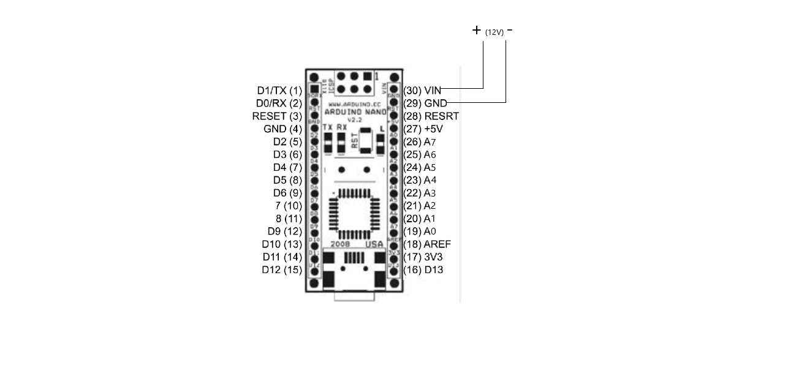
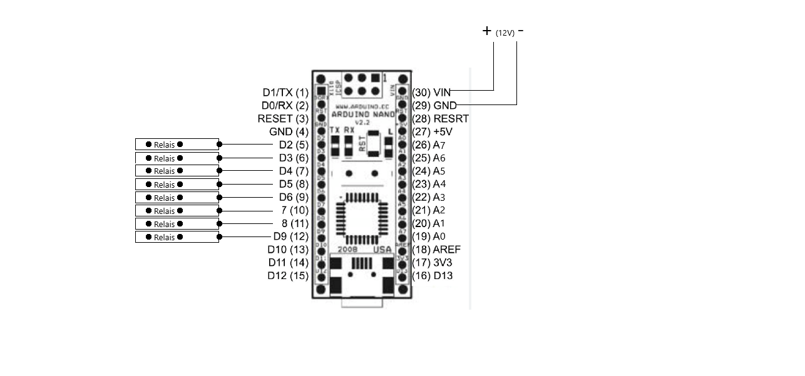
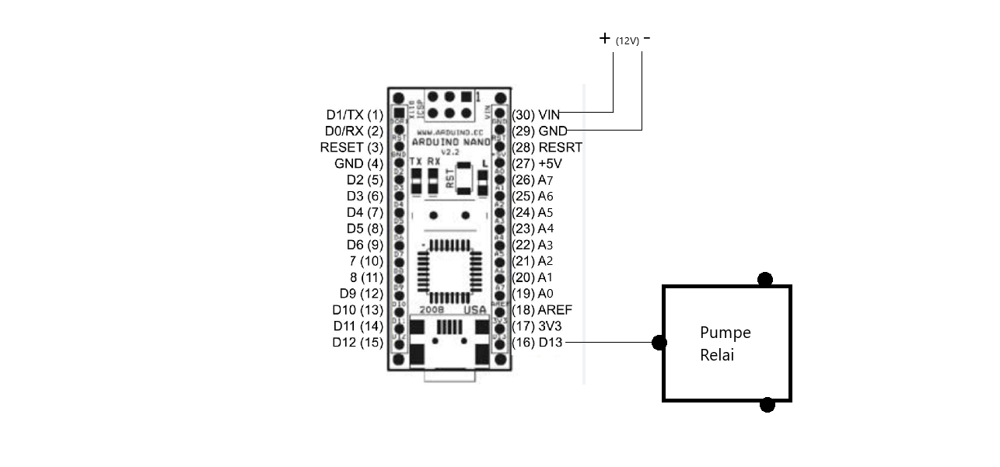
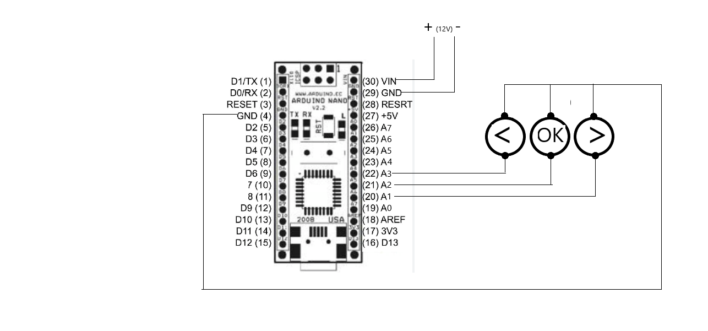

# boiler
Arduino Nano Program controls 8 relay, each of which is connected to a heater with a capacity of 4 kW each for heating the boiler to a given temperature. Also, a temperature and pressure sensor is connected for control.

## Projekt bauen
Folgen einem Schema, das unter ist. 
Wir brauchen zu Project:
 1. Arduino Nano mikrocontroller
 2. Acht Relais
 3. Temperature Sensor
 4. Druck Sensor
 5. Drei Knöpfen
 6. Relais für Pumpe
 7. Stromversorgung
 8. 5-Volt-Stromrichter
 9. Resistor 4,7 kOm
 10. Kabels
 
Empfehlung für Arduinos Stromversorgung ist 12 V. Mit weniger (5V) kann Man Displays Problem haben.

Bauen die Relais. Arduino stellt HIGH (Hochspannung oder so wie VCC - 5V) auf Pins (D2-D9), damit die Relais offen. Und Arduino stellt LOW (Niedrig Spannung oder so wie GND) auf Pins (D2-D9), damit die Relais schließen. Strom fdes Relais ist separat, vileicht vom 5-Volt-Stromrichter. Am Anfang steht immer LOW.

Bauen Pumpe. Arduino stellt HIGH auf Pin D13. Es gibt auf Arduino eine Lumineszenzdiode gegen das Zeichen "L". Wenn ist die Lumineszenzdiode an, dann es bedeutet, das HIGH auf Pin D13 steht.

Bauen Druck Sensor. Eingang: 0-150 psi. Ausgang: 0,5-4,5 V linearer Spannungsausgang 0 psi gibt 0,5 V aus, 75 psi gibt 2,5 V aus, 150 psi gibt 4,5 V aus. Kauf Interet Platform: https://www.ebay.de/itm/384977371166?chn=ps&var=652861261376&_trkparms=ispr%3D1&amdata=enc%3A1zT6-Mq_zSuOHVV8qfwRf2A31&norover=1&mkevt=1&mkrid=707-134425-41852-0&mkcid=2&mkscid=101&itemid=652861261376_384977371166&targetid=1716911581159&device=c&mktype=pla&googleloc=9044181&poi=&campaignid=17943303986&mkgroupid=140642150118&rlsatarget=pla-1716911581159&abcId=9301060&merchantid=7364532&gclid=Cj0KCQiA_bieBhDSARIsADU4zLeEDFnfmYdcE7FFeAYhwb3y_nJ414Tkexn2Y3HduTCS-r6IILnmIqAaAkXBEALw_wcB
Arduino misst Spannung von Pin A6. Eingang: 0-5 V. Ausgang: 0-1023 Bit. linearer Spannungsausgang 0 V gibt 0 Bit aus, 2,5 V gibt 512 Bit aus, 5 V gibt 1023 Bit aus. Der Druck wird nach der Formel berechnet: Druck (Bar) = analogRead(DruckPin) * 10.3421/818.4 - 1.293, wo analogRead(DruckPin) ist Ausgang Bit, 10.3421 für Übersetzung von Psi bis Bar. Das Programm misst den Druck 10 mal pro 30 Secund und zeigt eine Mittel. Internet Site mit Analogpinsanleitung: https://developer.alexanderklimov.ru/arduino/analogreadserial.php

Bauen Temperature Sensor. Der Sensor eingerichtet mit 4,7 kOm resistor. Das Programm misst die Temperature 1 mal pro 2-3 Secund (mit weniger Zeit empfiehlt  man nicht). Der Sensor arbeitet mit I2C, das heist, darf man langes Kabel benutzen. Genauichkeit ist bis Hundertstel (,00). Internet Site mit Anschlussanleitung: https://xn--18-6kcdusowgbt1a4b.xn--p1ai/%D1%82%D0%B5%D1%80%D0%BC%D0%BE%D0%B4%D0%B0%D1%82%D1%87%D0%B8%D0%BA-%D0%B0%D1%80%D0%B4%D1%83%D0%B8%D0%BD%D0%BE/
Kauf Interet Platform: https://www.ebay.de/itm/115542104461

Bauen Knöpfen. Es gibt links, rechts und OK Knöpfen. Reaktionszeit: 900ms. Reaktionszeit: 200ms, wenn man scrollen muss.

Bauen Pin A0. Pin arbeitet als ein Voltmeter: wenn die Spannung weniger als 4,5 V relativ Arduinos GND ist, dann alle Relais wird macht aus und die Benachrichtigung über Gefährlich geschrieben wird. Aber es arbeitet nicht, wenn Pin A0 so einfach zu VCC des 5-Volt-Stromrichters verbinden.

Bauen Pin A7. Pin arbeitet auch als ein Voltmeter: wenn die Spannung LOW ist (weniger als 2,5 V), dann alle Relais wird macht aus und die Benachrichtigung über Gefährlich geschrieben wird.Vileich braucht man AREF Pin benutzen, der auf dem Arduino ist der Pin, der den Referenzwert der Spannung für die analogen Eingänge darstellt.

